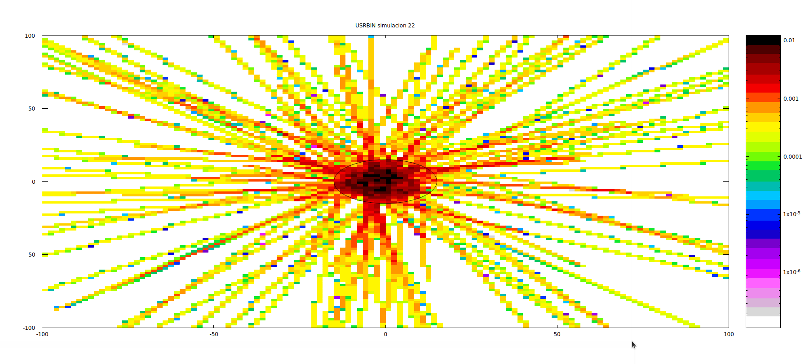

# **Simulación con FLUKA: Fuente de Partículas desde una Grilla Aleatoria**

Este proyecto utiliza **FLUKA** para simular una fuente de partículas personalizada basada en posiciones generadas aleatoriamente desde una grilla y una distribución de energía predefinida. La simulación estudia la interacción de las partículas generadas con un blanco de tungsteno cilíndrico rodeado por una región de vacío.

---

## **Descripción de la Simulación**

### **Objetivo**
Evaluar la interacción de una fuente de partículas definida externamente con un blanco de tungsteno, midiendo el flujo de neutrones en un volumen tridimensional. Esto permite estudiar la distribución espacial y energética de las partículas.

---

### **Geometría del Sistema**

1. **Región de Black Body:**
   - Esfera de radio muy grande (\( 100,000 \) cm) que absorbe todas las partículas que salen de la región de interés.

2. **Región de Vacío:**
   - Esfera de radio \( 10,000 \) cm que rodea al blanco.

3. **Blanco Cilíndrico:**
   - Cilindro de tungsteno con:
     - Radio: \( 15 \) cm.
     - Longitud: \( 80 \) cm.
     - Posicionado a lo largo del eje \( z \), comenzando en \( (0, 0, 0) \).

---

### **Configuración de la Fuente**

La fuente está definida en una subrutina **SOURCE** escrita en FORTRAN. Sus principales características son:

1. **Posiciones Iniciales:**
   - Las posiciones \( x \) e \( y \) se eligen aleatoriamente de una grilla definida por:
     - \( x_{¿min} = -5.0 \) cm, \( x_{¿max} = 5.0 \) cm.
     - \( y_{¿min} = -5.0 \) cm, \( y_{¿max} = 5.0 \) cm.
     - Paso: \( 1.0 \) cm (puede ser ajustado).
   - La posición \( z \) se fija en \( -1.0 \) cm.

2. **Dirección:**
   - Los cosenos directores (\( x, y, z \)) se calculan a partir de ángulos aleatorios \( \theta \) (entre \( 0 \) y \( \pi/2 \)) y \( \phi \) (entre \( 0 \) y \( 2\pi \)).

3. **Distribución Energética:**
   - Las energías se generan utilizando una distribución predefinida especificada en el archivo `No_Shielding.csv`.

---

### **Detector (USRBIN)**

- **Tipo:** Flujo de neutrones (\( NEUTRON \)).
- **Dimensiones:**
  - Volumen tridimensional definido desde \( (-100, -100, -100) \) cm hasta \( (120, 120, 120) \) cm.
  - Resolución: \( 10 \times 10 \times 10 \) celdas.

---

## **Parámetros de la Simulación**

1. **Semilla Aleatoria:** Establecida con `RANDOMIZ`.
2. **Eventos Simulados:**
   - Configurado para simular 10 eventos primarios (`START`).
   - Se recomienda aumentar este valor para obtener resultados estadísticamente significativos.

---

## **Archivos del Proyecto**

### **Archivos de Entrada**

1. **Archivo de Simulación:**
   - `simulacion.inp`: Define la geometría, materiales, detector y configuración general.

2. **Archivo de Fuente:**
   - `No_Shielding.csv`: Contiene la distribución energética de la fuente.

### **Archivos de Código**

1. **Subrutina de la Fuente:**
   - `random_grilla.f`: Define la fuente externa con posiciones y energías personalizadas.

### **Archivos Generados**

1. **Control de Simulación:**
   - `simulacion.flair`: Archivo para gestionar y analizar la simulación en la interfaz **FLAIR**.

2. **Resultados:**
   - Salidas de la simulación generadas por USRBIN y otros detectores.

---

## **Resultados Visuales**

Los resultados de la simulación incluyen visualizaciones del flujo de neutrones en el detector:

1. **Proyección en el Eje \( y \):**
   

2. **Proyección en el Eje \( z \):**
   

---

## **Mejoras Sugeridas**

1. **Ajustar la Grilla:**
   - Reducir o aumentar el paso para explorar configuraciones más detalladas o generales.

2. **Aumentar el Número de Eventos:**
   - Incrementar `START` para mejorar la estadística de los resultados.

3. **Optimizar el Detector:**
   - Ajustar el rango y la resolución del USRBIN para enfocarse en áreas específicas de interés.

---

## **Cómo Ejecutar la Simulación**

1. **Preparar el Entorno:**
   - Asegúrate de tener FLUKA y FLAIR instalados.

2. **Configurar la Fuente:**
   - Edita `random_grilla.f` si deseas personalizar la grilla o la distribución energética.

3. **Cargar el Archivo de Simulación:**
   - Abre `simulacion.flair` en FLAIR.

4. **Ejecutar la Simulación:**
   - Ejecuta desde FLAIR o con el comando:
     ```bash
     rfluka -e fluka -N0 -M1 simulacion
     ```

5. **Analizar los Resultados:**
   - Visualiza los resultados del detector (USRBIN) en FLAIR o exporta los datos para un análisis externo.

---

Con esta configuración, la simulación está lista para evaluar el comportamiento de la fuente de partículas generada y sus interacciones con el blanco de tungsteno. Si tienes dudas o necesitas personalizar la simulación, consulta las mejoras sugeridas o solicita ayuda.
