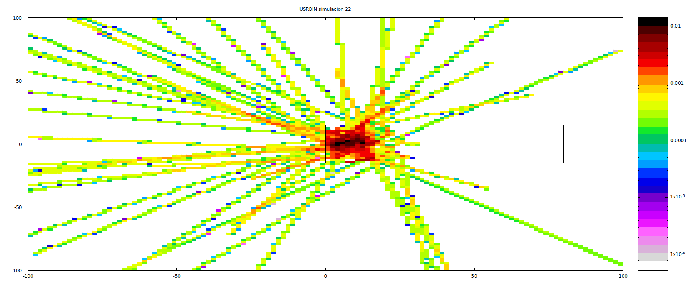

# **Simulación con FLUKA: Fuente de Partículas con Dirección Fija**

Este proyecto utiliza **FLUKA** para simular una fuente de partículas personalizada con dirección fija. La simulación estudia la interacción de estas partículas con un blanco cilíndrico de tungsteno, evaluando el flujo de neutrones en un volumen tridimensional.

---

## **Descripción de la Simulación**

### **Objetivo**
Analizar cómo interactúan las partículas generadas con una dirección fija con un blanco de tungsteno, evaluando la distribución espacial y energética del flujo de neutrones en un detector tridimensional.

---

### **Geometría del Sistema**

1. **Región de Black Body:**
   - Esfera de radio muy grande (\( 100,000 \) cm) que absorbe todas las partículas que salen de la región de interés.

2. **Región de Vacío:**
   - Esfera de radio \( 10,000 \) cm que rodea al blanco.

3. **Blanco Cilíndrico:**
   - Cilindro de tungsteno con:
     - Radio: \( 15 \) cm.
     - Longitud: \( 80 \) cm.
     - Posicionado a lo largo del eje \( z \), comenzando en \( (0, 0, 0) \).

---

### **Configuración de la Fuente**

La fuente está definida en una subrutina **SOURCE** escrita en FORTRAN. Sus principales características son:

1. **Posición Inicial:**
   - Coordenadas fijas:
     - \( x = 0.0 \) cm.
     - \( y = 0.0 \) cm.
     - \( z = -1.0 \) cm.

2. **Dirección:**
   - Los cosenos directores (\( x, y, z \)) están fijados en:
     - \( \cos(x) = 0.0 \).
     - \( \cos(y) = 0.5 \).
     - \( \cos(z) = 0.866 \).

3. **Distribución Energética:**
   - Las energías se generan utilizando una distribución predefinida especificada en el archivo `No_Shielding.csv`.

---

### **Detector (USRBIN)**

- **Tipo:** Flujo de neutrones (\( NEUTRON \)).
- **Dimensiones:**
  - Volumen tridimensional definido desde \( (-100, -100, -100) \) cm hasta \( (120, 120, 120) \) cm.
  - Resolución: \( 10 \times 10 \times 10 \) celdas.

---

## **Parámetros de la Simulación**

1. **Semilla Aleatoria:** Establecida con `RANDOMIZ`.
2. **Eventos Simulados:**
   - Configurado para simular 10 eventos primarios (`START`).

---

## **Archivos del Proyecto**

### **Archivos de Entrada**

1. **Archivo de Simulación:**
   - `simulacion.inp`: Define la geometría, materiales, detector y configuración general.

2. **Archivo de Fuente:**
   - `No_Shielding.csv`: Contiene la distribución energética de la fuente.

### **Archivos de Código**

1. **Subrutina de la Fuente:**
   - `fuente_direccion_unica.f`: Define la fuente externa con energías basadas en `No_Shielding.csv` y una dirección fija.

### **Archivos Generados**

1. **Control de Simulación:**
   - `simulacion.flair`: Archivo para gestionar y analizar la simulación en la interfaz **FLAIR**.

2. **Resultados:**
   - Salidas de la simulación generadas por USRBIN y otros detectores.

---

## **Resultados Visuales**

Los resultados de la simulación incluyen visualizaciones del flujo de neutrones en el detector:

1. **Proyección en el Eje \( y \):**
   

2. **Proyección en el Eje \( z \):**
   

---

## **Mejoras Sugeridas**

1. **Aumentar el Número de Eventos:**
   - Incrementar `START` para mejorar la estadística de los resultados.

2. **Optimizar el Detector:**
   - Ajustar el rango y la resolución del USRBIN para enfocarse en áreas específicas de interés.

3. **Personalizar la Dirección:**
   - Modificar los cosenos directores para explorar diferentes ángulos de incidencia.

---

## **Cómo Ejecutar la Simulación**

1. **Preparar el Entorno:**
   - Asegúrate de tener FLUKA y FLAIR instalados.

2. **Configurar la Fuente:**
   - Edita `fuente_direccion_unica.f` si deseas personalizar la distribución energética o la dirección de las partículas.

3. **Cargar el Archivo de Simulación:**
   - Abre `simulacion.flair` en FLAIR.

4. **Ejecutar la Simulación:**
   - Ejecuta desde FLAIR o con el comando:
     ```bash
     rfluka -e fluka -N0 -M1 simulacion
     ```

5. **Analizar los Resultados:**
   - Visualiza los resultados del detector (USRBIN) en FLAIR o exporta los datos para un análisis externo.

---

Con esta configuración, la simulación está lista para evaluar el comportamiento de la fuente de partículas generada y sus interacciones con el blanco de tungsteno. Si tienes dudas o necesitas personalizar la simulación, consulta las mejoras sugeridas o solicita ayuda.
